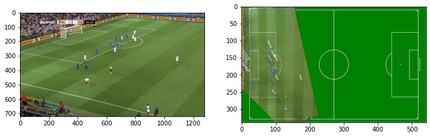
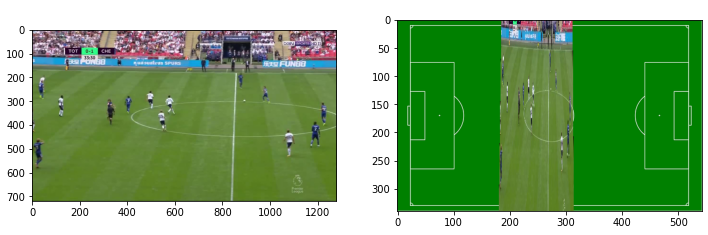
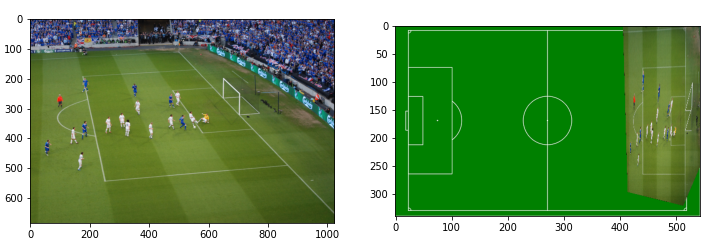

# Homography-Matrix-Computation-in-Soccer-Images
## Project Overview
In this project, homography matrix is calculated between the soccer images and 2D soccer model. This project is made for EEE4512 Image Processing class. Details of the 
project can be found in the [report](https://github.com/omerkolcak/Homography-Matrix-Computation-in-Soccer-Images/blob/master/EEE4512%20-%20Report.pdf). 
## Algorithm
Homography matrix is calculated by detecting key points in the soccer field, and matching them with the 2D model. Details of the algorithm can be read in the [report](https://github.com/omerkolcak/Homography-Matrix-Computation-in-Soccer-Images/blob/master/EEE4512%20-%20Report.pdf). The below images show the final output of the algorithm.  

